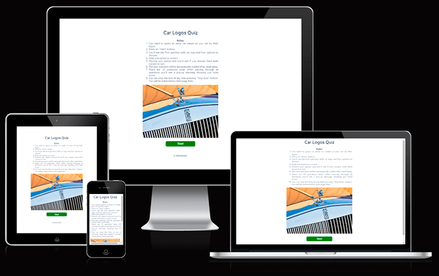
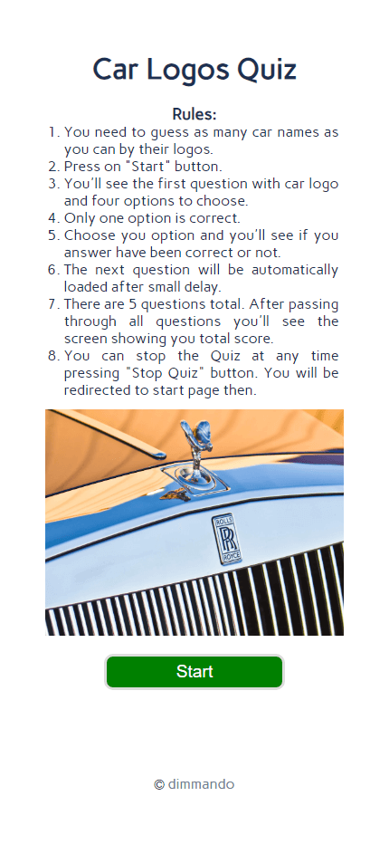
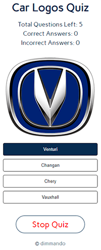
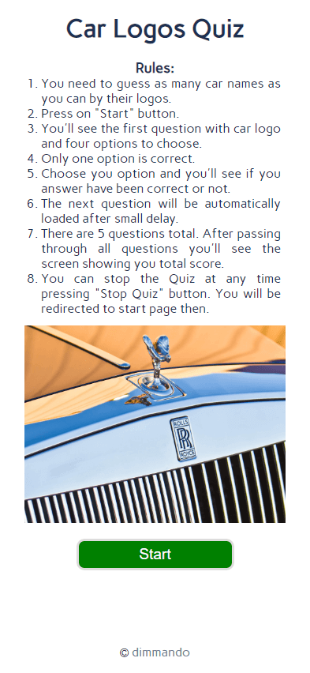
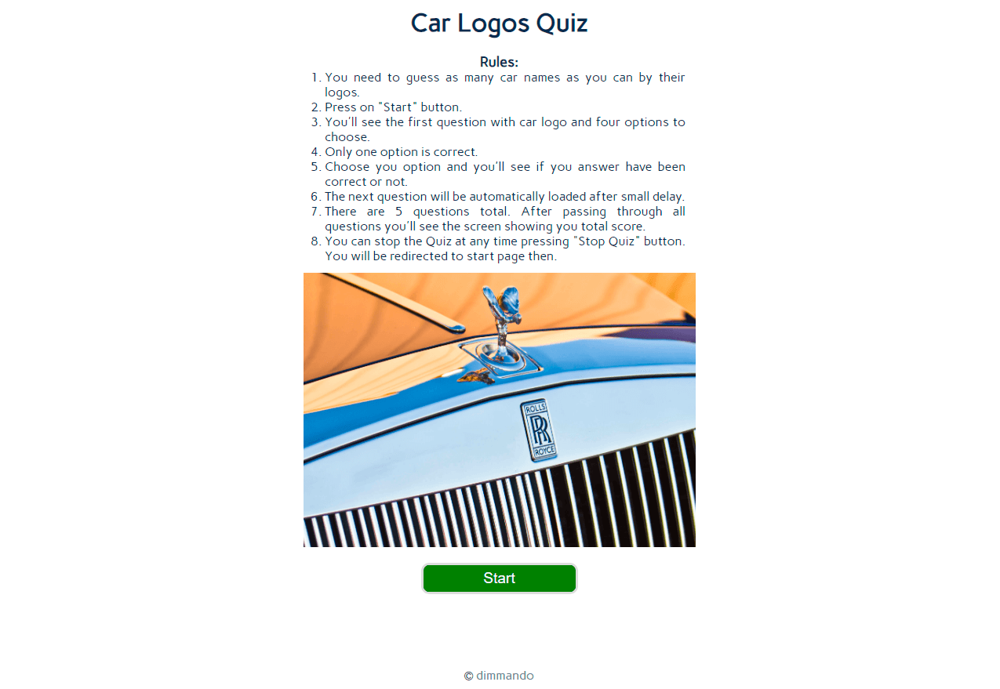
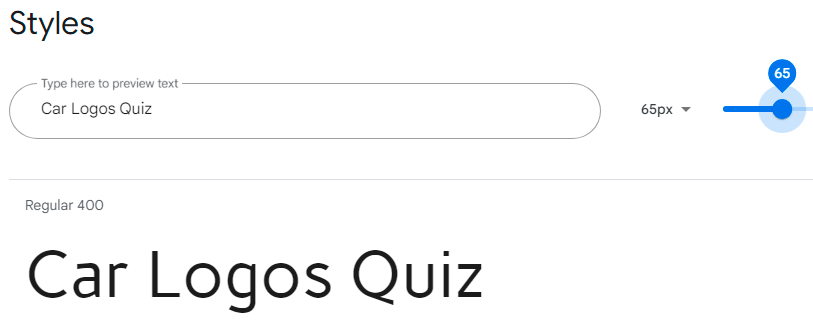

---

# *Car Logos Quiz*

Car Logos Quiz is the online test of your knowledge of car brands and their logos. The test presents logos of car brands from different countries. If the user does not like the results, Quiz can be passed through as many times as desired. The car logos and answer options will be the same.

Car Logos Quiz can be accessed by this [link](https://dimmando.github.io/logos/)

---
## User Stories

### First Time Visitor Goals:

* As a First Time Visitor, I want to easily understand the main purpose of the site and also if I have reached to the needed place for me. So I can read what site is about immediately at the top of the screen.
* As a First Time Visitor, I want to be able easily navigate through the website pages, so I can find the content required. It's all in one place in compact size on the screen.
* As a First Time Visitor, I want to easy start using functionality. The Start button is easy accesible on the main page.

### Returning Visitor Goals:

* As a Returning Visitor, I want to pass through the test if I didn't. So I can start it just in one click.
* As a Returning Visitor, I want to see how my score is count and how many questions left. So it's information always right in front of my eyes.
* As a Returning Visitor, I want to see my final score.  So it's information always in the end of Quiz.

### Frequent Visitor Goals:

* As a Frequent User, I want to have possibility restart the Quiz easily to try it again to earn more points if I have found out that my score is too low. So I can restart the Quiz at any time.

## Features

+ ### Home Page

    - Represent:
        * Logo of the Quiz.
        * Quiz Rules.
        * Decoration image.
        * Quiz "Start" button.
        * Footer with the link to creator's repository.

​    

---

+ ### Question Page
    - Positioned at the center of the page.
    - Contains text logo of the Quiz linked with the homepage.
    - Just below the Quiz logo is placed scores area. It contains:
        * "Correct Answers" counter - counts how much questions user answered correctly.
        * "Incorrect Answers" counter - counts how much questions user answered incorrectly.
        * "Total Questions Left" counter - counts how much questions left for user to pass through.
    - Below the scores area user can see the logo of a car that he/she needs to guess.
    - The 4 answer options are placed below the car logo and have animated hover effect.
    - The navigation between options is clear and easy to understand for the user.
    - Below choosing options user can see the button "Stop Quiz" that can cease the game at any time.
    
    

    - Car Logos Quiz is responsive.
        * On mobile devices: content placed has "narrow style".

            
        
        * On tablet or laptop/desktop: when user see from high resolution device content become wider.

            

---
## Technologies Used

- [HTML](https://developer.mozilla.org/en-US/docs/Web/HTML) - was used as the foundation of the site.
- [CSS](https://developer.mozilla.org/en-US/docs/Web/css) - was used to add the styles and layout of the site.
- [JavaScript](https://developer.mozilla.org/en-US/docs/Web/JavaScript) - was used to create interactivity with the user.

## Frameworks, Libraries & Programes Used
- [Google fonts](https://fonts.google.com) - Google fonts were used to import the 'Carme' font into the HTML file which is used on all pages throughout the project
- [Font Awesome](https://fontawesome.com) - Font Awesome was used on all footer of the pages throughout the website to add icon for aesthetic and UX purposes.
- [Git](https://gitpod.io) - Git was used for version control by utilizing the Gitpod terminal to commit to Git and Push to GitHub.
- [GitHub](https://github.com) - GitHub is used to store the projects code after being pushed from Git.

---
## Design

### Color Scheme

- Сolors of the Car Logos Quiz website are neutral. Buttons colors were choosen as usual practice: green - for correct answer, red - for incorrect.

### Typography

- Carme Google Font was used as the main font of the website in order to increase readability and beautyfication of the content on the pages.

### Wireframes

#### Mobile devices

- [Home Page. Mobile Screen](documentation/mobile_home_page.jpg)
- [Question Page. Mobile Screen](documentation/mobile_question_page.jpg)
- [Results Page. Mobile Screen](documentation/mobile_resulst.jpg)

#### Tablets/Desktop

- [Home Page. Tablet/Desktop Screen](documentation/tablet_home_page.jpg)
- [Question Page. Tablet/Desktop Screen](documentation/tablet_question_page.jpg)
- [Results Page. Tablet/Desktop Screen](documentation/tablet_results_page.jpg)

---

## Testing

Please refer to the [TESTING.md](TESTING.md) file for all test-related documentation.

---

## Deployment

### Deployment to GitHub Pages

- The site was deployed to GitHub pages. The steps to deploy are as follows: 
  - In the [GitHub repository](https://github.com/dimmando/logos), navigate to the Settings tab 
  - From the source section drop-down menu, select the **Main** Branch, then click "Save".
  - The page will be automatically refreshed with a detailed ribbon display to indicate the successful deployment.

The live link can be found [here](https://dimmando.github.io/logos/)

### Local Deployment

In order to make a local copy of this project, you can clone it.
In your IDE Terminal, type the following command to clone my repository:

- `git clone https://github.com/dimmando/logos.git`

- Alternatively, if you use Gitpod, you can [click here](https://gitpod.io/#https://github.com/dimmando/logos), which will start the Gitpod workspace for you.

---

## Future features
- add custom 404 page;

---
## Credits

+ #### Media

    - All images and logos for the website have been taken from free car logos repository:
        [Carlogos.org](https://www.carlogos.org)
    

+ #### Tools

    - [Adobe Photoshop](https://www.adobe.com) was used to resize and crop images.
    - [TinyPNG](https://tinypng.com/) was used to smart WebP, PNG and JPEG compression for faster Websites.
---
