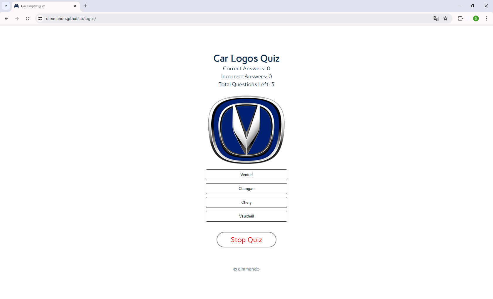
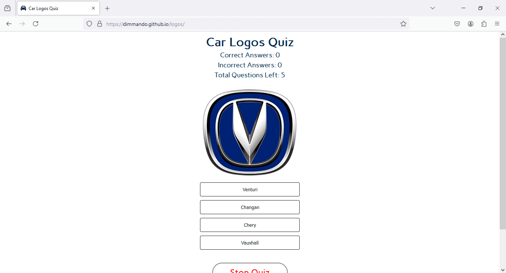
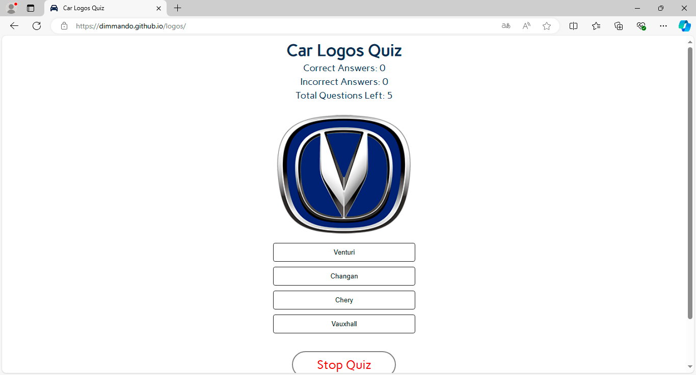
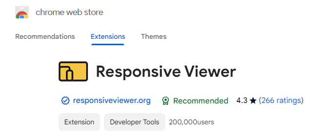
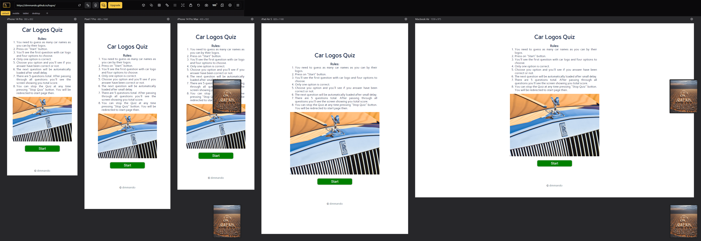
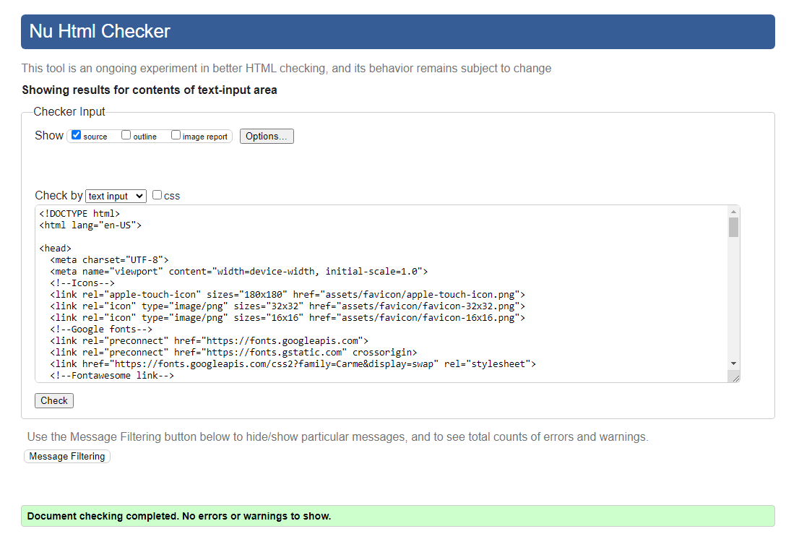
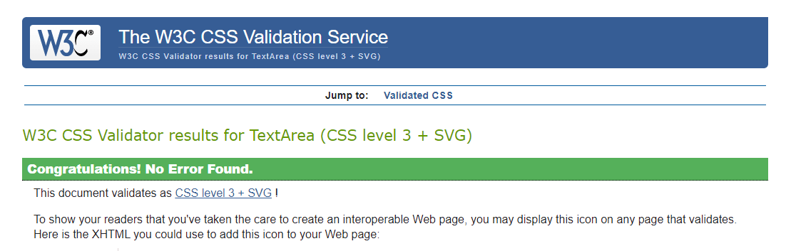
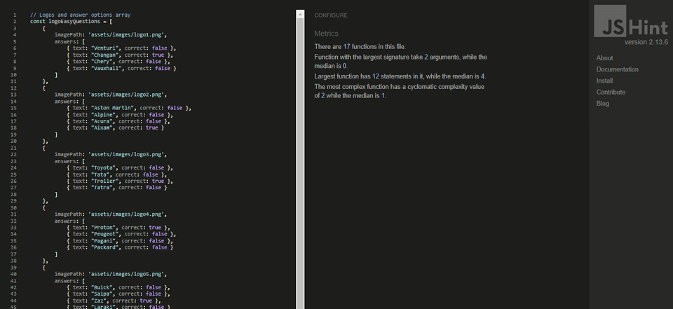
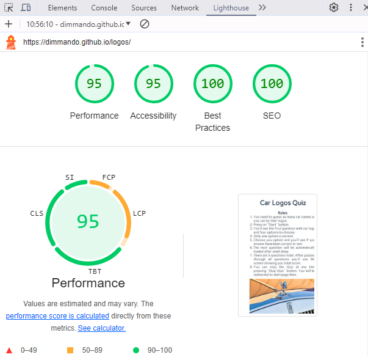
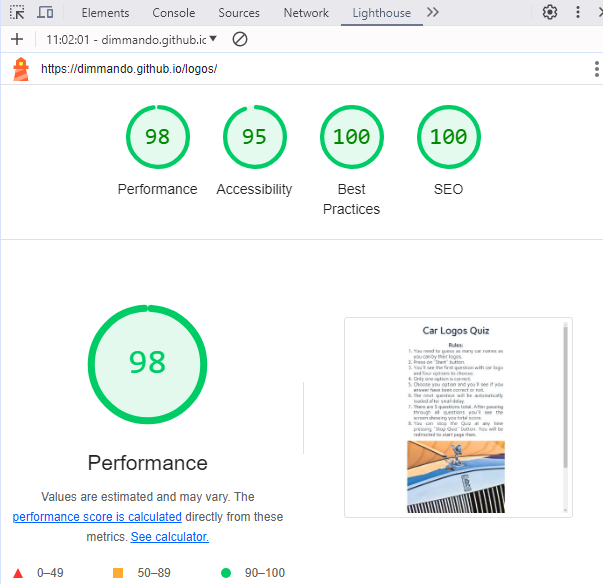

# TESTING

## Compatibility

In order to confirm the correct functionality, responsiveness, and appearance:

+ The website was tested on the following browsers: Chrome, Firefox, Edge.

    - Chrome:

    

    - FireFox:

    

    - Edge:

    

## Responsiveness

+ The website was checked by Responsive Viewer - a trial version of Chrome browser extension:

    

    - Main Page:

    

+ The functionality of the Car Logos Quiz website was checked as well by different users.

---
## Validator testing
+ ### HTML (Home Page)
  No errors or warnings were found when passing through the official W3C validator.

  
        
+ ### CSS
  No errors or warnings were found when passing through the official W3C (Jigsaw) validator

  

+ ### JavaScript
  No errors or warnings were found when passing through the official JSHint validator

    

## LightHouse report

    - Using lighthouse in devtools I confirmed that the website is performing well, accessible and colors and fonts chosen are readable.
    
  ### Home page

  + Mobile version

  

  + Desktop version
  
  
---

## Testing user stories
 
User Story |  Test | Pass
--- | --- | :---:
I want to understand the main purpose of the site | I can easily read heading text Car Logos Quiz just at the top of home page in the center of the screen. | &check;​
I want to be able easily navigate through the website | I can easily find the content required. It's all in one place, in compact size and in the center of the screen. | &check;​
I want to easily start using functionality. | The "Start" button is easily accesible on the main page in the center of the screen. | &check;
I want to pass through the test if I haven't yet | I can start it just in one click on "Start" button. | &check;
I want to see how my score is being counted and how many questions left. | These information always right in front of my eyes with every Quiz question. | &check;
I want to see my final score | I can see it each time the Car Logos Quiz finishes at the last page of the Quiz. | &check;
I want to have possibility restart the Quiz easily to try it again to earn more points if I have found out that my score is too low. | I can restart the Quiz at any time either by pressing "Stop Quiz" button or press "New Quiz" button at the end. | &check;

## Bugs
+ ### Solved bugs
    There were some bugs in JavaScript code specifically in score counters and in Start New Quiz button action at the end of the Quiz but all issues were resolved.
    
        *Solutions:* periodically checking console.log() outputs in Console of DevTools Chrome Browser.

+ ### Unsolved bugs
    None.

+ ### Mistakes
    Mistakes were made in CSS alignment different elements but all of them finally have been solved by proper styling.    
---